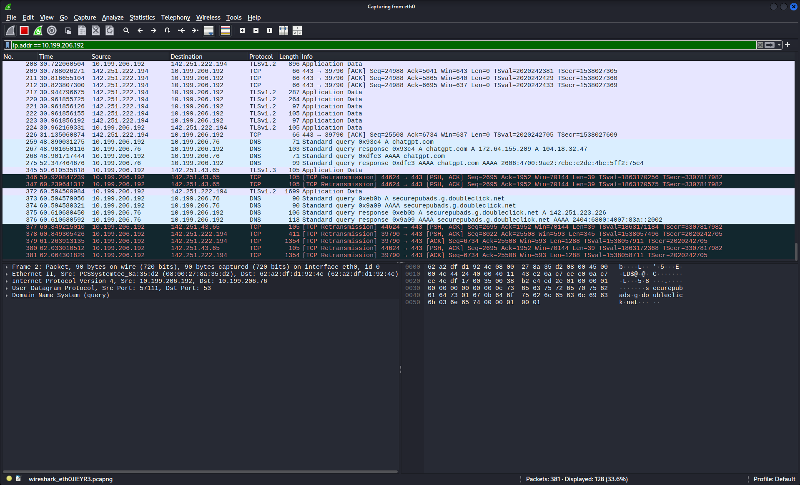
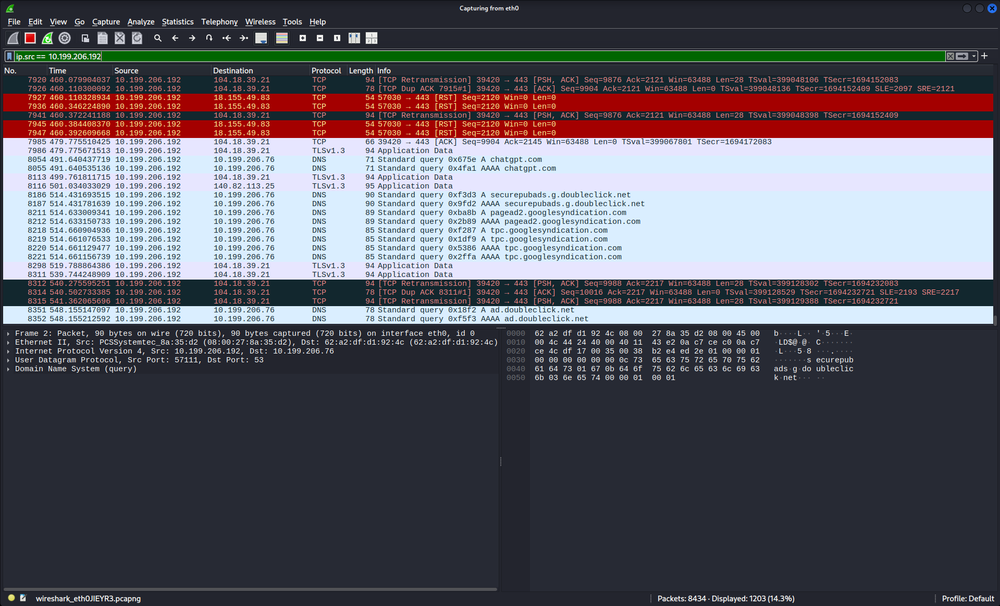
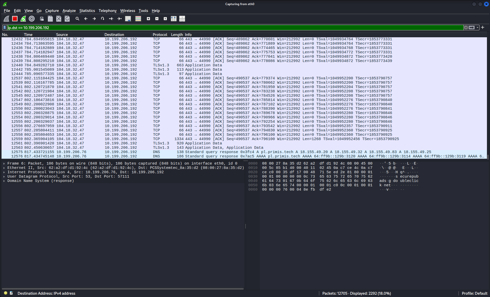
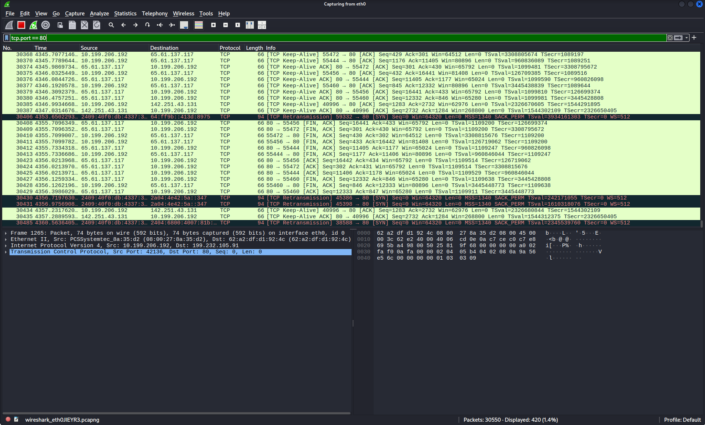
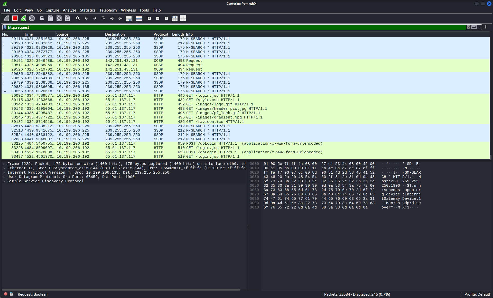
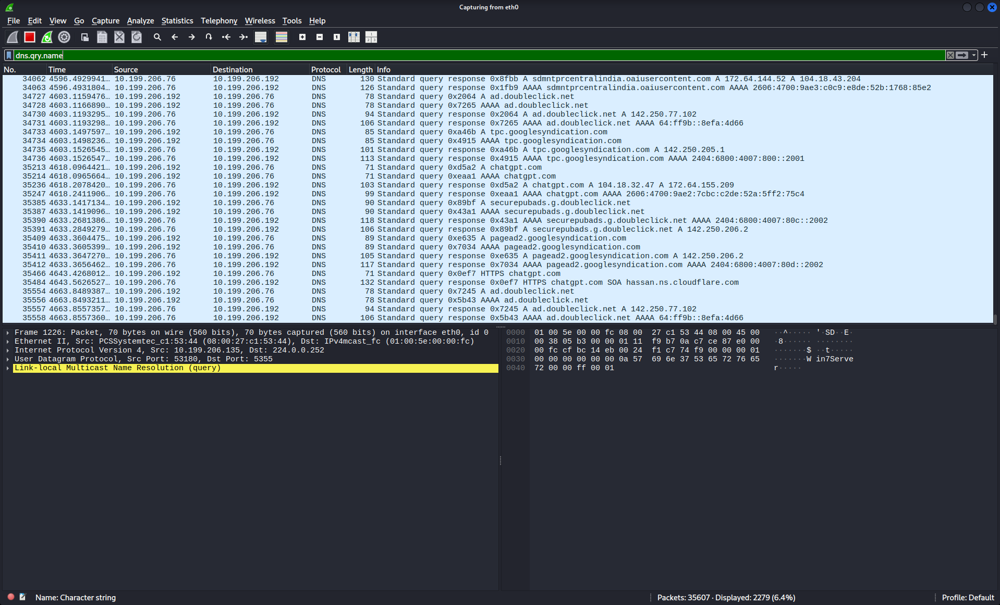

# network-sniffing-and-traffic-analysis

# Part 1 – Introduction to Network Sniffing

## Objective

I want to understand the basics of network sniffing. This includes how sniffers work and the different types of sniffing. I also want to learn about the protocols that're vulnerable to sniffing attacks and how to detect and prevent these attacks.

---

# What is Network Sniffing?

Network sniffing is when you monitor and capture the data packets that travel across a network.

Security professionals use tools to capture these packets and analyze the network traffic.

They do this for troubleshooting. To check the networks performance and security.

Attackers can also use sniffing to capture sensitive information that is sent over the network without proper security.

---

## 1. Understanding Network Sniffing

### What We Are Learning

I am learning about the purpose of network sniffing and how it is used in cybersecurity.

Network sniffing is used to capture packets that travel across a network.

### Description

A network sniffer is a tool that captures these packets without changing them.

It can be used for things like troubleshooting the network and responding to incidents.

It can also be used for bad things like intercepting sensitive information if the communications are not properly protected.

---

## 2. Understanding Sniffers

### What We Are Learning

I am learning what a network sniffer is and how it works.

### Description

A sniffer is a software or hardware tool that captures network packets in time.

Security analysts use sniffers to investigate what is happening on the network.

They use it to identify patterns of communication and to analyze the protocols that are used.

Some examples of sniffers are Wireshark, tcpdump and Bettercap.

---

## 3. Types of Sniffing

### Active Sniffing

sniffing is when you interact with a switched network by sending packets to intercept communications.

For example you might send ARP traffic to a network to get information about the devices that are connected to it.

### Passive Sniffing

Passive sniffing is when you just listen to the network traffic without sending any packets.

This is typically done on shared-media networks.

---

## 4. Protocols Vulnerable to Sniffing

There are some protocols that're more vulnerable to sniffing than others.

These include HTTP, FTP, Telnet, POP3, SMTP, IMAP and SNMP.

These protocols do not encrypt the information they transmit.

So if someone captures the packets they can read the information easily.

---

## 5. Detection and Countermeasures

### Detection Methods

To detect sniffing you can observe the network traffic. Look for anything unusual.

You can also check the ARP tables for any changes.

There are tools that can help you detect ARP spoofing and other types of sniffing.

### Countermeasures

To prevent sniffing you can use HTTPS of HTTP.

You can use SSH of Telnet and SFTP instead of FTP.

You should encrypt the network communications to prevent interception.

You should also use wireless encryption like WPA2 or WPA3.

You should monitor the systems for any suspicious network activity.

---

## Screenshot 1


---

## Screenshot 2


---

# Key Concepts Learned

- Network Sniffing

- Packet Capture

- Active Sniffing

- Passive Sniffing

- Network Protocols

- Detection Methods

- Security Countermeasures

---

# conclusion

In this part I learned what network sniffing is.

I learned how sniffers capture network traffic.

I learned about the difference between passive sniffing.

I learned which protocols are vulnerable to sniffing attacks.

I learned common techniques used to detect and prevent network sniffing attacks.

I learned a lot about network sniffing and how to protect against it.

Network sniffing is a topic, in cybersecurity.

I will keep learning about network sniffing and how to prevent it.

----------------------------------------------------------------------------------------------------------------------------------------------------------------------

# Part 2 – Looking at Network Traffic Using Wireshark Display Filters

## Objective

I want to learn how to use Wireshark display filters to look at network traffic find out which computers are talking to each other and understand what protocols are being used when I am analyzing packets.

---

# What are Wireshark Display Filters?

Wireshark display filters help me look at the packets that I want to see without changing the traffic that I have captured.

They help me get rid of information which makes it faster and easier to analyze packets when I am trying to fix a problem or investigating a security issue.

---

## 1. Look at Traffic by IP Address

### What I Am Doing

I want to see all the packets that are associated with an IP address.

### Filter

```text

ip.addr == 192.168.31.253

```

### Description

This filter shows me all the packets where the IP address I specified's either the source or the destination.

### Screenshot



---

## 2. Look at Traffic by Source IP Address

### What I Am Doing

I want to see packets that are sent from a computer.

### Filter

```text

ip.src == 192.168.31.253

```

### Description

This filter shows me the packets that come from the source IP address I specified.

### Screenshot



---

## 3. Look at Traffic by Destination IP Address

### What I Am Doing

I want to see packets that are sent to a computer.

### Filter

```text

ip.dst == 192.168.31.253

```

### Description

This filter shows me the packets that are going to the destination IP address I specified.

### Screenshot



---

## 4. Look at Traffic by TCP Port

### What I Am Doing

I want to see packets that are using a TCP port.

### Filter

```text

tcp.port == 80

```

### Description

This filter shows me all the packets that are using the TCP port I specified which helps me find traffic that is associated with a network service.

### Screenshot



---

## 5. Show HTTP Requests

### What I Am Doing

I want to see the packets that are HTTP requests.

### Filter

```text

http.request

```

### Description

This filter shows me HTTP request packets, which makes it easier for me to analyze web traffic and understand what the client is asking for.

### Screenshot



---

## 6. Show DNS Queries

### What I Am Doing

I want to see DNS query packets.

### Filter

```text

dns.qry.name

```

### Description

This filter shows me DNS query packets, which helps me find out what domain names the computers on the network are asking for.

### Screenshot



---

# Key Things I Learned

- Wireshark Display Filters

- Source IP Address

- Destination IP Address

- Port Filtering

- HTTP Request Analysis

- DNS Query Analysis

- Packet Filtering

- Network Traffic Analysis

---

# conclusion

In this part I learned how to use Wireshark display filters to look at network traffic that I have captured.

I learned how to find packets using source and destination IP addresses.

I also learned how to filter traffic based on ports.

I found out how to identify HTTP requests and DNS queries.

I understand why display filters are important, for analyzing packets

Wireshark display filters help security analysts look at network activity and find the traffic that's important when they are investigating a security issue.

-------------------------------------
